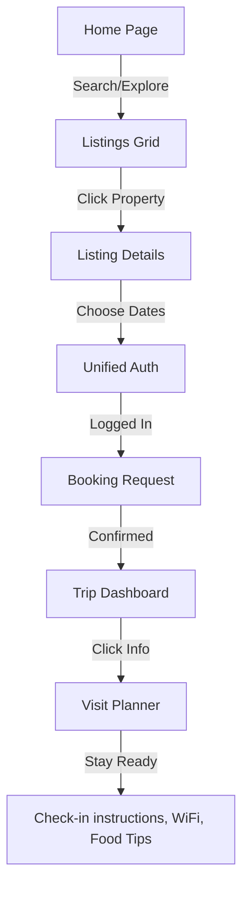
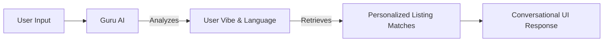

# 🌟 xRentz — Modern Rental Marketplace

[](https://vitejs.dev/)
[](https://reactjs.org/)
[](https://www.framer.com/motion/)

> **Elevate your travel experience with the world's most immersive rental platform.**

xRentz is a premium, high-performance rental marketplace designed for modern travelers and hosts. Built with speed, localization, and a "vibe-first" discovery engine, it redefines how we find our next stay.

---

## 🗺️ Application Workflow

Understanding the seamless flow of xRentz from discovery to stay.

### 1. User Journey Flow


### 2. AI Intelligence (xRentz Guru)


---

## ✨ Key Features

### 🌍 Global Localization & Currency
xRentz is built for the global citizen. Our internal `t()` translation engine and `formatPrice()` utility ensure that every user sees the interface in their native language and preferred currency (USD, INR, EUR, GBP) without a single page reload.

### 🤖 xRentz Guru AI Assistant
Integrated directly with the **Google Gemini Pro** engine, our AI Guru doesn't just answer questions; it understands "Vibes." Tell it you want a "cozy cabin with a chill energy" and it will scan listing metadata to find your literal soulmate-stay.

### 🚀 Smart Visit Planner
Found in the **User Dashboard**, this feature auto-generates a comprehensive digital itinerary for every confirmed trip:
- **Documents**: Required ID and verification status.
- **Access**: High-security codes and WiFi keys.
- **Local Tastes**: Curated food & beverage picks based on the listing's GPS location.

---

## 🛠️ Architecture & Tech Stack

### Frontend Core
- **React 18**: Component-based architecture for high scalability.
- **Vite**: Ultra-fast build tool for an optimized developer experience.
- **Context API**: Managing global state for Auth, Language, and Currency.

### Experience Layer
- **Framer Motion**: Powering all spatial transitions and micro-interactions.
- **Vanilla CSS3**: Utilizing a robust CSS Variable system for theming and consistency.
- **Google Fonts**: Inter & Plus Jakarta Sans for premium typography.

---

## 📂 Project Navigation

```bash
src/
├── components/   # UI blocks (Navbar, VibeCarousel, AI Agent)
├── context/      # AppContext (Language, Currency, User State)
├── data/         # Listing Database & Vibe Profiles
├── hooks/        # Voice Search & Form Handlers
├── pages/        # Core Views (Home, Auth, Dashboard, Support)
├── services/     # Gemini AI & Weather integrations
└── translations/ # Multi-language Dictionary
```

---

## 🚀 Getting Started

1. **Clone & Enter**
   ```bash
   git clone https://github.com/SourabhX16/xRentz.git
   cd xRentz
   ```

2. **Install & Launch**
   ```bash
   npm install
   npm run dev
   ```

---

## ⚖️ License & Ethical Hosting
Distributed under the MIT License. We promote **Responsible Hosting** through our support guides and community forums.

---

<p align="center">
  DESIGNED FOR THE FUTURE OF TRAVEL • <b>XRENTZ</b> 🏠
</p>
